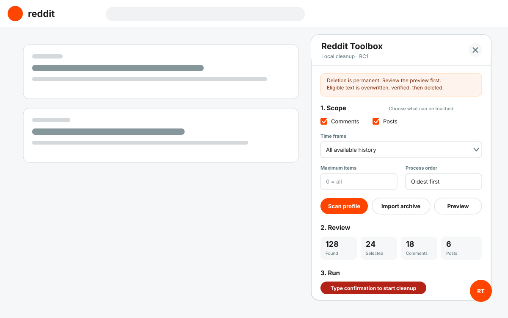

# Reddit Toolbox

**[Install Reddit Toolbox RC2 with Tampermonkey](https://raw.githubusercontent.com/slaveofsolace/Reddit-Toolbox/main/userscripts/reddit-toolbox.user.js)**

Local-first, automated Reddit history cleanup for your own account. Choose comments and posts, narrow the scope, review the exact batch, confirm once, and let the toolbox process the entire selection without per-item clicks.

> **RC2 status:** the automated batch engine and safety suite are complete. The current Reddit session adapter still requires authenticated acceptance testing with disposable content before this should be treated as a stable release.



## Install

1. Install [Tampermonkey](https://www.tampermonkey.net/).
2. In Chrome, open `chrome://extensions/?id=dhdgffkkebhmkfjojejmpbldmpobfkfo` and enable **Allow User Scripts**.
3. Open the **[Reddit Toolbox userscript](https://raw.githubusercontent.com/slaveofsolace/Reddit-Toolbox/main/userscripts/reddit-toolbox.user.js)** and choose **Install**.
4. Sign in to Reddit, reload the page, then select the orange **RT** button.

Read [Installation](docs/INSTALLATION.md) before the first cleanup. Verify downloaded copies against `SHA256SUMS.txt`.

## Automated workflow

1. Scan the signed-in profile or import `comments.csv` and `posts.csv` from a Reddit data export.
2. Select comments, posts, a date window, an amount, order, subreddit exclusions, score protection, or matching text.
3. Prepare and review the finite batch.
4. Type the displayed confirmation once.
5. Select **Run entire batch**. Reddit Toolbox handles the remaining items automatically.

The panel may be closed while the batch runs. The launcher shows progress and reopens the panel when attention is required. Keep the Reddit tab open until the batch finishes.

## What the engine does

For every editable comment or self-post, the engine automatically:

```text
revalidates the signed-in account
→ verifies ownership
→ generates random replacement letters
→ saves the overwrite
→ verifies the saved text
→ deletes the item
→ verifies deletion
→ advances to the next selected item
```

Requests remain sequential and paced to avoid overlapping destructive actions. Rate limits are waited out automatically. Temporary failures are retried automatically. Isolated permanent failures are recorded and the batch continues; five consecutive failures pause the batch for review.

Link and media posts have no editable body. They are skipped unless direct deletion is explicitly enabled in the reviewed batch.

## Controls and recovery

- **Pause batch** stops before the next operation boundary.
- **Stop after current item** lets the in-flight item settle safely, then marks the remainder as stopped.
- **Prepare retry batch** creates one new reviewed batch containing only failed and stopped items.
- A browser-level exclusive lock prevents two Reddit Toolbox batches from running at the same time where the Web Locks API is available.
- Reloading or navigating away never silently resumes a destructive run.

## Complete history

Reddit profile listings may not expose an account's entire lifetime history. Request a copy of your Reddit data, extract it, and import `comments.csv` and `posts.csv`. Profile and archive records are merged by exact Reddit fullname, with live profile data preferred when both exist.

## Data and permissions

Reddit Toolbox runs in the browser tab. It does not ask for a Reddit password, copy cookies, use remote analytics, or upload archive contents. Only preferences are persisted. Imported content, reviewed batches, replacement strings, and active run state remain in memory unless you explicitly export a file.

The project is not affiliated with or endorsed by Reddit. Use it only with content owned by the account currently signed in and comply with Reddit's current terms and API rules.

See [Privacy](docs/PRIVACY.md), [Security](SECURITY.md), and [Architecture](docs/ARCHITECTURE.md).

## Develop

Requirements: Node.js 20 or newer.

```sh
npm run check
```

RC2 passes 54 automated tests plus final userscript syntax and integrity checks. The build has no runtime dependencies. `src/userscript-metadata.txt` and the ordered source files produce `userscripts/reddit-toolbox.user.js` deterministically.

## RC2 handoff

Authenticated Reddit acceptance, OAuth contingency work, and release gates are documented in [Codex Handoff](docs/CODEX_HANDOFF.md) and [Release Checklist](docs/RELEASE_CHECKLIST.md).

## License

MIT licensed. Copyright (c) 2026 [slaveofsolace](https://github.com/slaveofsolace).
